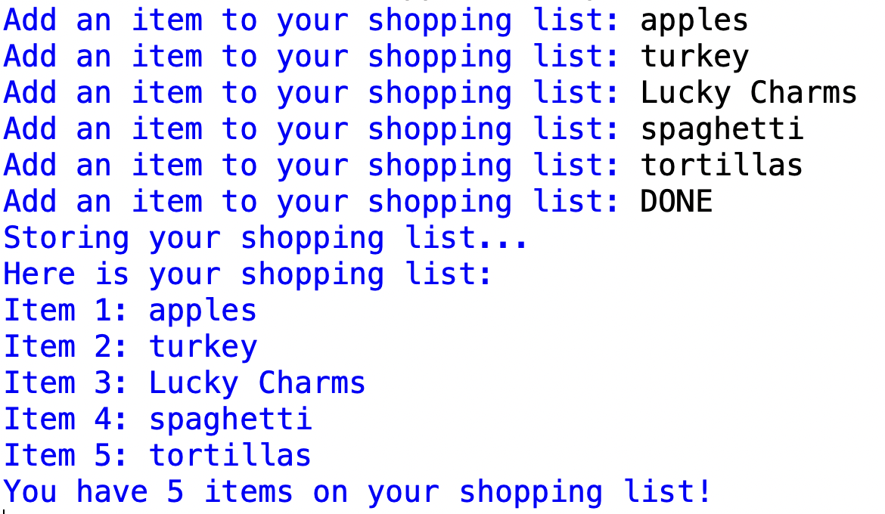
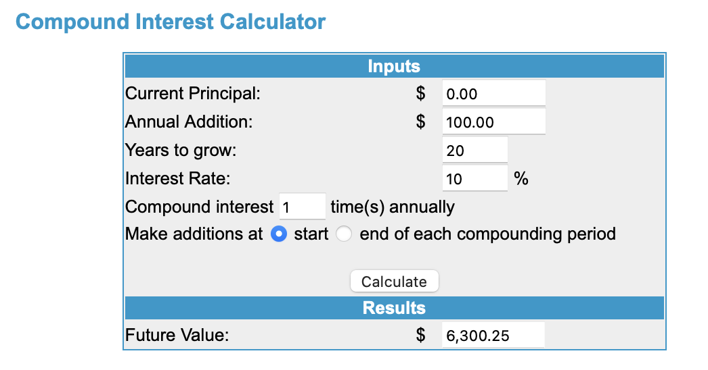

# Problem Set 3
If you are seeing this, you have accepted the invitation in GitHub Classroom. If you have not cloned your copy of the repo (`ps3-yourusername`) down to your own machine using GitHub Desktop, do so now.

You will be adding three new Python files to your repo:

* `ps3-part1.py`
* `ps3-part2.py`
* `ps3-part3.py`

You will commit and push these new files to your repo on GitHub on the internet using GitHub Desktop. If you don't remember how to do this, please review the instructions in Problem Set 1.

If you are having trouble with GitHub come to office hours. 

**NEW!** I now expect you to write comments in your code! One point will be deducted if you do not provide comments explaining your code. Here's what I would like commented this time:

* Before every function, describe what it does and what its arguments are (if any).
* Before every variable, explain what value it is holding.

**NEW!** Now at the top of very files, you will include your honor pledge. The first four lines (comments) of every Python file should be this information. You will lose one point if you don't include these four lines.

* The name of the file.
* Your name.
* The date.
* "This code is my own work. I did not share my code or look at the code of another student. I did not consult ChatGPT, CoPilot, or another large language model."

### This problem set is due Monday, September 16, at 11:59pm EDT.

## Part 1: Shopping list app

Using IDLE, open a new file and save it into your `ps3-yourusername` repo as `ps3-part1.py`. This program will contain the following:

1. A `main()` function that does the following:

* Create an empty list variable called `shoppinglist`.
* Ask the user to enter an item to add to their shopping list.
   - **While** they enter anything but "DONE", append that item to `shoppinglist`, and ask for another item.
   - When they enter "DONE", stop asking them for more items.
* Call the function `save_shoppinglist()` passing in the `shoppinglist` argument. (See #2 below.)
* Call the function `print_shoppinglist()`. (See #3 below)


2. A function `save_shoppinglist(mylist)` where `mylist` is a list variable. This function will do the following:

* Open a file called `my_shoppinglist.txt` for writing.
* Write out each element in the list argument `mylist` to `my_shoppinglist.txt`, where each item is preceded by `Item X: ` where `X` is the number of the item in the list. Remember to insert a new line after each item.
* Close `my_shoppinglist.txt`

3. A function called `print_shoppinglist()`, which does the following:

* Open the file `my_shoppinglist.txt` for reading.
* Print out each line in the file. Remember to remove the new line or to suppress the automatic new line with `print()`!
* Close the file `my_shoppinglist.txt`
* Print the number of items in the shopping list.

4. A call to `main()` at the end of the program.

Here's a sample run of this program. Your output should look the same, but of course with different items. You may use any fancy tricks with `print()` and string manipulation to make your output look like the sample.




## Part 2: Iterative interest calculator

For this problem, you will build a financial calculator that can be used to calculate the future value of a retirement account. This is an idealized retirement account, where each year the person deposits the same amount of money on January 1, and the same interest rate is applied to the balance on December 31.

For example, suppose you deposit $100.00 per year for three years in a retirement account that earns 10% interest. On January 1 of year 1, you deposit your $100. On December 31, you will earn $10.00 interest (i.e., 10% of $100.00) giving you a balance of $110.00 after 1 year. On January of year 2 you will deposit another $100.00, giving you a balance of $210.00. Then, on December 31 of year 2, you will earn $21.00 interest (i.e., 10% of $210.00) giving you a balance of $231.00 after 2 years. On January 1 of year 3, you again deposit $100.00, giving you $331. On December 31, interest is calculated ($33.10) and added to the current balance ($331), giving you $364.10. 

Your program will be called `ps3-part2.py` and will do the following. **You don't need to write anything into its own function.**

1. Print a message explaining that it is a retirement calculator and will be asking some questions.
2. Prompt the user to enter the size of the annual deposit in dollars.
3. Prompt the user to enter the interest rate **as a decimal** (so 10% would be 0.10).
4. Prompt the user to enter the number of years until retirement **as an integer**.
5. **Using a `for` loop,** calculate the  value of the retirement account when the user retires.
6. Print the value of the retirement account when the user retires rounded to two decimal places.

You can check your math with this handy calculator, entering 0 for the `Current principal`.

http://www.moneychimp.com/calculator/compound_interest_calculator.htm

Here is a sample run of the program and the corresponding info entered into the calculator. Remember that your output should look like mine. You should use what you know about print and f-strings to make it look right!

```
Welcome to the retirement calculator!
Enter the size of the annual deposit each year: 100
Enter the interest rate as a decimal: .10
Enter an integer for the number of years until retirement: 20
You will have $6300.25 when you retire.

```



## Part 3: Maximizing the value of a mathematical function  

A lot of what we do in the machine learning part of data science is try to maximize (or minimize) the value of some mathematical function $f(x)$. We will see later how this can help us provide the mostly likely predictions or classifications when we give input to a model.

One way to do this is to sweep through possible values for $x$ and see which one gives us the maxmimum (or minimum) output. You start by setting $x$ to be some small starting value, calculate $f(x)$ with that value of $x$, and then slowly increase $x$ by some regular interval, each time calculating $f(x)$, until $x$ reaches some larger ending value. You keep track of which value of $x$ gave you the largest (or smallest) output. 

In this problem, we  want to find the value of $x$ that maximizes $f(x)$ where $f(x)$ is the quadratic function you all remember from high school:

$f(x) = ax^2 + bx + c$

The user will supply the values for $a$, $b$, and $c$. You will start with $x=0$ and increment $x$ by 0.01 up to and including $x=1$. At the end, you will report the maximum value of $f(x)$ over $0 \le x \le 1$, and the value of $x$ that gave this maximum value.

Here's what the equation will look like in Python:

`a*x**2+b*x+c`

Here's what your program should containL

1. A `main()` function that asks the user for $a$, $b$, and $c$. Then call `max_while(a b,c)` passing in the user's input. Then call `max_for(a,b,c)`.

2. A function called `max_while(a, b, c)` that calculates the value of $x$ that maximizes the quadratic function and then reports that maximum value and $x$ displaying the first two decimal places **using a while loop**.

3. A function called `max_for(a, b,c)` that that calculates the value of $x$ that maximizes the quadratic function and then reports that maximum value and $x$ displaying the first two decimal places **using a for loop**. Remember that `range()` takes only integer arguments, so you will have to think creatively!

Your input and output messages must conform to the following sample runs. Keep in mind that after you implement step 3, the final line will be repeated by the `max_for()` function.

```
Enter a: -1
Enter b: 1
Enter c: 0.25
The max value is 0.50 when x is 0.50

Enter a: -4
Enter b: 0.5
Enter c: 2
The max value is 2.02 when x is 0.06
```   

---

## Deadline: Monday, September 16, at 11:59pm EDT.

## Deliverables

1. `ps3-part1.py` (Part 1: Shopping List)
2. `ps3-part2.py` (Part 2: Interest Calculator)
3. `ps3-part3.py` (Part 3: Maximizing f(x))

## Reminder: Important Guidelines
* Your problem set must be submitted with GitHub. If you are struggling to use GitHub, the TAs or I can help during office hours.
* You do not need to do error checking of user input. You can assume the user will always enter the kind of input you ask for.
* Points will be deducted if your output does not match the required format.
* Points will be deducted if your files are not named as required.
* Points will be deducted if your files are not in the correct location (i.e., in the top-level directory where you see the `README`.)
* Points will be deducted if you do not include comments as desribed above.
* Points will be deducted if you do not include your honot pledge at the top of eachf file.

